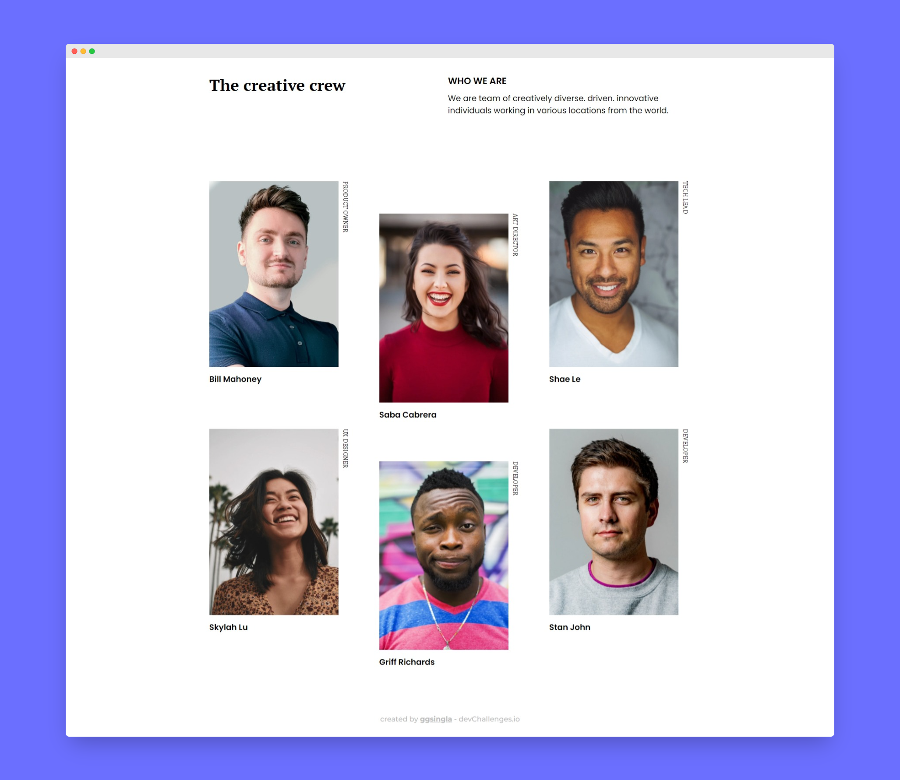

<h1 align="center">My Team Page</h1>

   Solution for a challenge from  <a href="http://devchallenges.io" target="_blank">Devchallenges.io</a>.

  <h3>
    <a href="https://devchallenge-2.onrender.com/">
      Demo
    </a>
     | 
    <a href="https://github.com/ggsingla/devChallenges.io/tree/main/my-team-page-master">
      Solution
    </a>
     | 
    <a href="https://devchallenges.io/challenges/hhmesazsqgKXrTkYkt0U">
      Challenge
    </a>
  </h3>

## Overview

This is a **My Team Page** with a minimal design. You can see the live demo for the same with the link provided at the top.

Feel free to copy any code if you find a use for it in your own projects, you can directly use this page in your project after changing the CSS just a little bit.
  

> Note: This application/site was created as a submission to a [DevChallenges](https://devchallenges.io/challenges) challenge. The [challenge](https://devchallenges.io/challenges/wBunSb7FPrIepJZAg0sY) was to build an application to complete the given user stories.

### Built With

- [HTML](https://developer.mozilla.org/en-US/docs/Web/HTML)
- [CSS](https://developer.mozilla.org/en-US/docs/Web/CSS)

### Features

- Mobile-First Approach
- Semantic HTML
- CSS variables
- Fully Responsive

## Reach Me

- Instagram [@gautam_s27](https://www.instagram.com/gautam_s27/)
- GitHub [@ggsingla](https://github.com/ggsingla)
- Twitter [@ggsingla](https://twitter.com/ggsingla)
